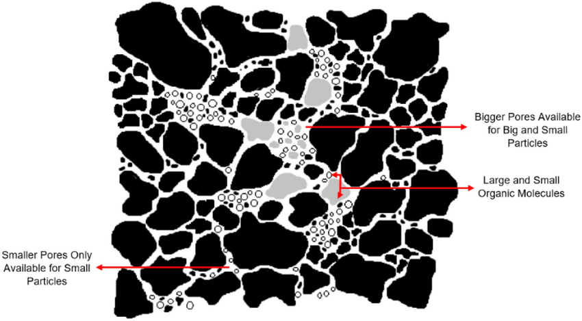
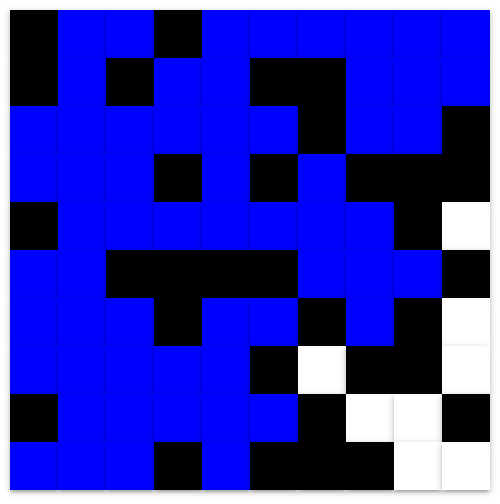

# Water Percolation Skeleton
Get started by typing in the command below into the terminal.
```
pip install -r requirements.txt
```

Then open up simulation with the command below.
```
python main.py
```

# The Problem
If you keep zooming into a rock, you will find that it has a lot of holes. These holes are called pores.



A rock can have a lot of pores, in which case we say that the rock has a high ***porosity***. A rock with a few amount of holes has a low porosity.

The porosity of a rock affects how well that rock can filter water. For example, a rock with very high porosity will let all the water percolate through, filtering out nothing. On the other hand, if the rock has zero porosity, none of the water can get to the other side.

The question is:
> **How porous should the rock be to best filter water?**

"Best" means:
- Water makes a lot of contact with the rock.
- Water can make it through to the other side, in which case we say that the water ***percolates***.

# Simulating Rock and Water
A rock is really messy, coming in all shapes and sizes. Even if they all come in the same shape and size, we need to find rocks with a variety of porosity values. Collecting those rocks can be a tedious task, so what we can do instead is to write a ***simulation*** using code. A simulation is a simpler version of the real world. It's cheaper and quicker than performing the experiment in the real world.

For example, we'll simplify a rock to be a square grid.

In this grid, each cell has a chance to be opened. The higher the chance of it being opened, the more porous the entire grid will be. This "chance of being opened" is our simplified version of the rock's porosity.

Water starts at the top row in opened cells. Then, these watered cells fill their neighboring open cells with water. The process repeats!

Here's a 10x10 grid filled with water.



In summary, our assumptions are:
- Rock -> square grid
- Porosity -> chance of cell being opened
- Water flow -> watered cells fill neighboring cells

### Problem: `create_grid()`
We have written the code for randomly opening the cell.

Now it is up to you to create the square grid. Fill out the `create_grid()` function in the `grid.py` file. Given a whole number (like `10`), return a square grid of all zeros with that length.

First, double check if the problem makes sense by running in the terminal:
```
python checker -q create_grid -u
```

Then, fill out the function and test it with:
```
python checker -q create_grid
```

If your code works, you can open up the simulation and see a black and white grid.

### Problem: `step()`
Each cell in the grid can have the following values:
```
0 -> closed
1 -> opened
2 -> filled
```

We can take a step forward in time by following the "flowing water" rule: for each filled cell, water the adjacent open cells. This means converting every adjacent cell with a `1` to a `2`.

Fill out the `step()` function in the `grid.py` file. The down direction has been done already, as an example.

Double check that the problem makes sense by running in the terminal:
```
python checker -q step -u
```

Then, fill out the function and test it with:
```
python checker -q step
```

# Sources
- [Original exercise by Princeton](https://introcs.cs.princeton.edu/java/24percolation/).
- Diagram of porous rock from [this paper](https://www.researchgate.net/figure/Schematic-diagram-showing-the-tortuosity-of-a-porous-media-with-narrow-and-wide-irregular_fig1_369234921).
- [okpy](https://okpy.github.io/documentation/), for the auto grader.
